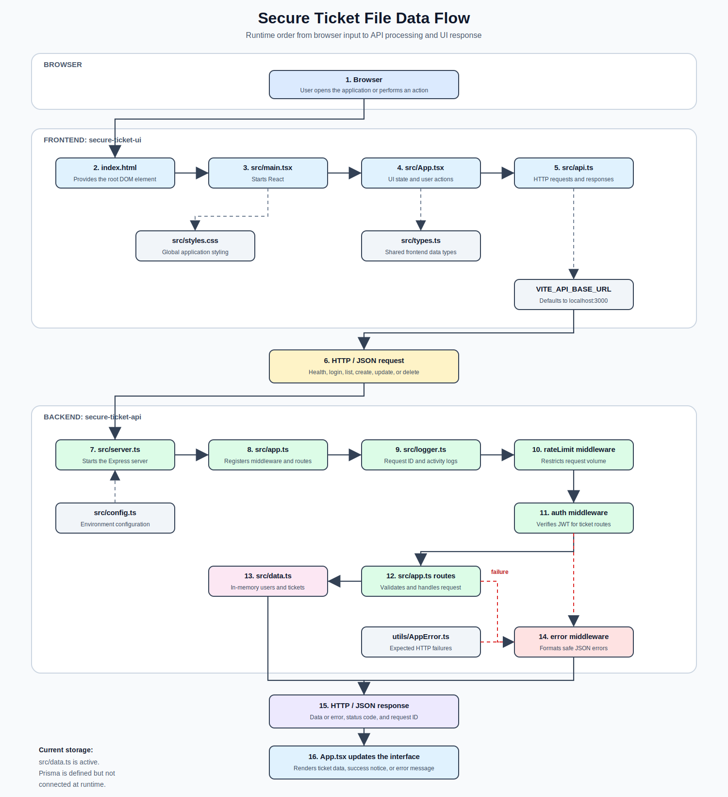

# File Data Flow

## Current Storage

`secure-ticket-api/src/data.ts` is the active ticket store. Changes remain only
while the backend process is running.

`secure-ticket-api/prisma/schema.prisma` defines the planned database model, but
the runtime request flow does not currently use Prisma or a database.

## Main Request Paths

| User action | Frontend call | Backend route | Data result |
| --- | --- | --- | --- |
| Open application | `api.health()` | `GET /health` | API availability |
| Sign in | `api.login()` | `POST /auth/login` | JWT returned |
| Load tickets | `api.tickets()` | `GET /tickets` | Ticket array returned |
| Create ticket | `api.createTicket()` | `POST /tickets` | Ticket added to memory |
| Update ticket | `api.updateTicket()` | `PATCH /tickets/:ticketId` | Ticket changed in memory |
| Delete ticket | `api.deleteTicket()` | `DELETE /tickets/:ticketId` | Ticket removed from memory |
