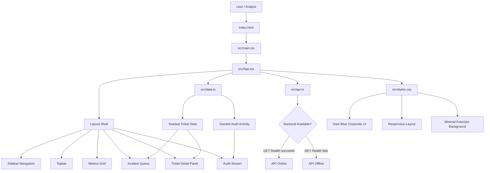
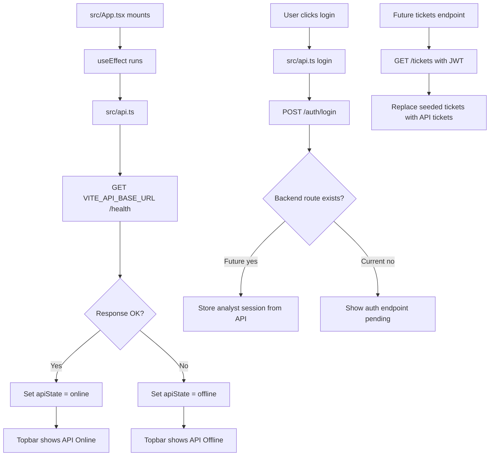
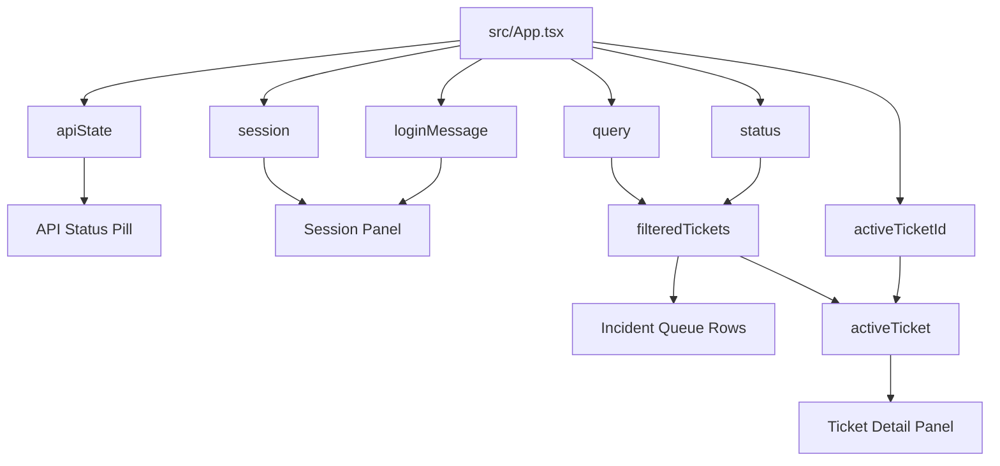
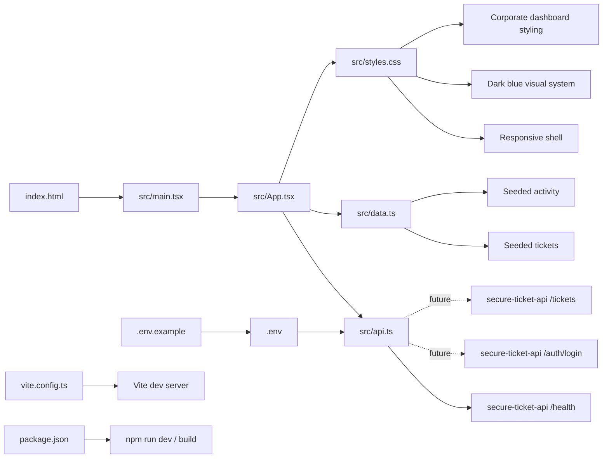

# XFlow: AegisCore UI

`xflow` format means:

1. Mermaid flowchart.
2. Short explanation that follows the chart in order.
3. File names included where they matter.

## UI Architecture

## Backend Connection Flow

## UI State Flow

## File-Based Flow

## Explanation

The UI starts at `index.html`, which loads `src/main.tsx`.

`src/main.tsx` mounts React and renders `src/App.tsx`.

`src/App.tsx` is the main screen. It owns the dashboard layout, user session state, API health state, search state, status filter, and selected ticket state.

`src/api.ts` is the connection point to the backend. Right now it calls `/health`, and it already has placeholders for `/auth/login` and `/tickets`.

`src/data.ts` provides seeded ticket and audit data while the backend ticket/auth endpoints are still being built.

`src/styles.css` controls the professional dark blue corporate visual system, responsive layout, panels, buttons, queue rows, and background treatment.

When the app loads, it calls the backend health endpoint. If `/health` succeeds, the UI shows `API Online`. If it fails, the UI shows `API Offline`.

When the user clicks login, the UI attempts to call `/auth/login`. Since that backend route is not built yet, the UI shows that the auth endpoint is pending but still lets the console operate in demo analyst mode.

When `/tickets` exists later, `src/api.ts` can replace the seeded data from `src/data.ts` with real ticket data from the backend.
